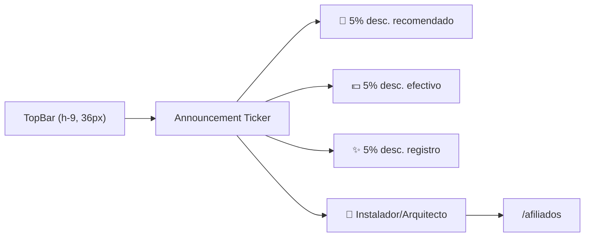
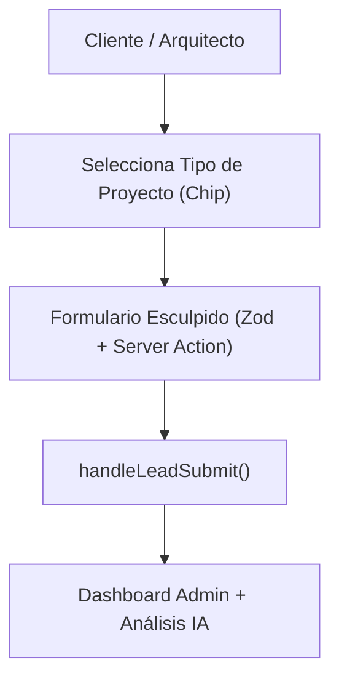

# 🏛️ Rediseño Luxury Arquitectónico & Sistema Visual A+

Este documento documenta la evolución estética hacia los estándares de oro de arquitectura europea e internacional (inspirado en **OH Architecture**, **AEC Construction Portfolios** y **Siiimple Architecture**), enlazado con [[06_UI_UX_Premium]] y [[blueprint]].

---

## 🎨 1. Nueva Paleta de Materialidad (Piedra, Travertino y Cuarzo)

Se erradicó el azul corporativo saturado en favor de una paleta con resonancia mineral y arquitectónica:

- **Modo Claro (Alabastro & Travertino):**
  - `--background`: Travertino suave mineral `hsl(40, 20%, 98%)` (`#FAF8F5`).
  - `--foreground`: Carbón basáltico editorial `hsl(220, 15%, 13%)` (`#1C1F24`).
  - `--primary`: Pizarra grafito profunda `hsl(220, 16%, 18%)` (`#252A32`).
  - `--secondary`: Bronce arquitectónico / Latón champagne `hsl(38, 48%, 46%)` (`#AD823B`).
  - `--border` / `--input`: Mortero fino y juntas de cal `hsl(38, 12%, 88%)` (`#E7E4DC`).

- **Modo Oscuro (Obsidiana, Basalto y Latón Champagne):**
  - `--background`: Obsidiana basalto profundo `hsl(220, 14%, 8%)` (`#111316`).
  - `--foreground`: Crema Calacatta cálido `hsl(40, 24%, 94%)` (`#F6F4ED`).
  - `--card`: Pizarra antracita `hsl(220, 12%, 11%)` (`#171A1E`).
  - `--primary`: Oro cuarzo / Latón champán `hsl(38, 52%, 56%)` (`#CF9F4F`).
  - `--border`: Vena fina de basalto `hsl(220, 10%, 18%)` (`#282C33`).

---

## 📢 2. Cinta / Marquesina de Anuncios (Inspirada en OH Architecture)

Ubicada en `src/components/layout/top-bar.tsx`:
- Track de marquesina continua con looping suave (`announcement-ticker-track`) que se pausa al hacer hover (`hover:[animation-play-state:paused]`).
- Separador editorial con glifo de diamante de latón `✦`.
- Transición a `top-0` en `header.tsx` sin estilos en línea (`style={{ top: topOffset }}` removido).

---

## 📐 3. Sección de Contacto en Proporción Áurea (5:7)

Rediseño integral de `src/components/home/contact/`:
- **Columna Izquierda (`lg:col-span-5`): Atelier de Diseño & Showroom**
  - Concierge directo por WhatsApp con micro-interacción táctil (`active:scale-[0.98]`).
  - Teléfono y Correo electrónico ofuscado contra bots (`info&#64;modularesgm.com`).
  - Pilares de calidad arquitectónica (Modelado 3D, Cuarzos y Piedras sinterizadas, Montaje con herrajes europeos).
  - Mapa integrado con carga diferida (`IntersectionObserver`) y coordenadas del Showroom.
- **Columna Derecha (`lg:col-span-7`): Formulario Esculpido de Precisión**
  - Selector de chips interactivos: *Cocina Integral, Mesón de Cuarzo, Clóset & Vestidor, Mobiliario Comercial, Remodelación Total*.
  - Inputs con micro-etiquetas arquitectónicas y altura balanceada (`h-11 sm:h-12`).
  - Botón de envío con feedback visual (`active:scale-[0.98]`) y garantías de respuesta en 24h.
  - Atributos WebMCP intactos para asistentes y agentes de IA.

