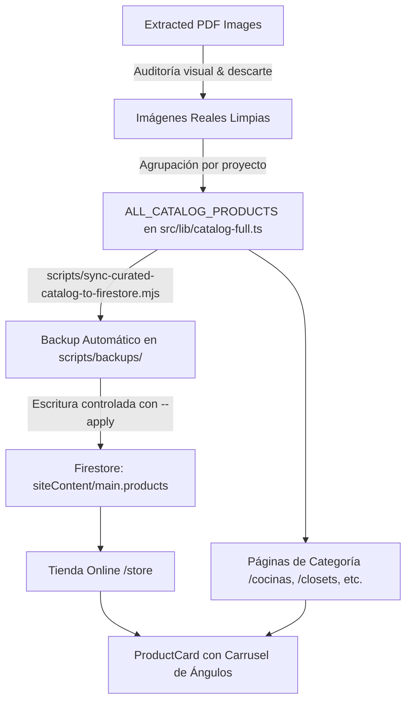

# 🛋️ 08. Curaduría de Catálogo y Sincronización de Tienda (Store Sync & Multi-Angle Carousel)

Este documento detalla la arquitectura de curaduría de productos, el sistema de carrusel multi-ángulo interactivo en tarjetas de producto y la sincronización limpia entre el código estático y Firestore (`siteContent/main`).

Relacionado con:
- [[catalogo_maestro]]
- [[06_UI_UX_Premium]]
- [[07_Architectural_Luxury_Redesign]]

---

## 🎯 1. Problema Raíz Resuelto

1. **Eliminación de Artefactos de PDF:**
   - La importación automática previa (`import-catalog-to-store.mjs`) había extraído indiscriminadamente todas las páginas de los catálogos PDF a Firestore (134 productos), resultando en:
     - El producto 1 de Cocinas mostrando un sofá de sala (portada del PDF).
     - Las últimas páginas de cada categoría mostrando diapositivas de despedida con logotipos y números telefónicos.
     - Máscaras negras y lienzos vacíos (`img-000.png` y `img-001.png`).
     - Múltiples fotos del mismo proyecto divididas en 4 o 5 productos duplicados e incompletos.
2. **Consolidación en Proyectos Curados con Múltiples Ángulos:**
   - Se agruparon las tomas y perspectivas del mismo mueble en un solo producto representativo utilizando el arreglo `images: [...]`.
   - 0 fotos de portada erróneas, 0 diapositivas de despedida, 0 lienzos en blanco.

---

## 🏗️ 2. Flujo de Sincronización y Renderizado



---

## 🖼️ 3. Distribución Final de Productos Curados (41 Proyectos)

| Categoría | Total Proyectos | Ángulos por Proyecto | Destacados |
| :--- | :---: | :---: | :--- |
| **Cocinas** | 8 | 2 a 5 fotos | Cocina Luxury Capuccino con Techo LED, Waterfall Calacatta, Total White, Black Velvet |
| **Closets** | 8 | 2 a 4 fotos | Walk-in Boutique Vidrio Bronce, Vanity Halo LED, Zapateras 6 niveles, Escandinavo |
| **Muebles de Baño** | 4 | 2 fotos | Vanity Doble Pozo con Espejo Circular LED, Nicho Hotelero Nogal, Suspendido Nórdico |
| **Puertas** | 4 | 2 fotos | Pivotante Monumental 2.60m, Granero Industrial con 5 cristales, Guía Oculta |
| **Gamer** | 3 | 2 fotos | Cielo Nublado LED RGB, Battlestation Pro Triple Monitor, Setup Cyberpunk |
| **Muebles de Oficina** | 7 | 2 fotos | Escritorio Gerencial en L, Counter Corporativo Frontal/Posterior, Mesa Directorio 14P |
| **Escritorios** | 7 | 2 a 3 fotos | Línea Estudiantil Ergonómica 201-207 con tableros 18mm Pelikano RH |
| **TOTAL** | **41** | **Multi-ángulo** | **100% verificado en disco y Firestore** |

---

## 🕹️ 4. Experiencia Interactiva en `ProductCard`

El componente `src/components/store/product-card.tsx` incorpora:
1. **Control de Ángulo en Tarjeta:**
   - Botones de navegación previa y siguiente (`ChevronLeft` y `ChevronRight`) accesibles en hover en desktop y permanentemente en mobile.
   - Puntos indicadores (dots pills) en el centro inferior que muestran activamente qué foto se está visualizando.
   - Badge indicador superior con contador dinámico `X/Y fotos`.
2. **Sincronización con Modal de Vista Rápida ("QuickView"):**
   - Al hacer clic en el botón de ojo o en el título/imagen, el modal se abre exactamente en el ángulo seleccionado previamente en la tarjeta.
3. **Cero Estilos en Línea:**
   - Implementado 100% con clases de Tailwind CSS, gradientes sutiles y micro-interacciones `active:scale-95`.

---

## 🔒 5. Protocolo de Respaldo Firestore

Antes de aplicar cualquier cambio sobre Firestore, el script genera una copia de seguridad timestamped en `scripts/backups/`:
- `scripts/backups/backup-siteContent-main-1791416984173.json`

Para resincronizar en el futuro tras añadir nuevos modelos:
```bash
node scripts/sync-curated-catalog-to-firestore.mjs --apply
```
