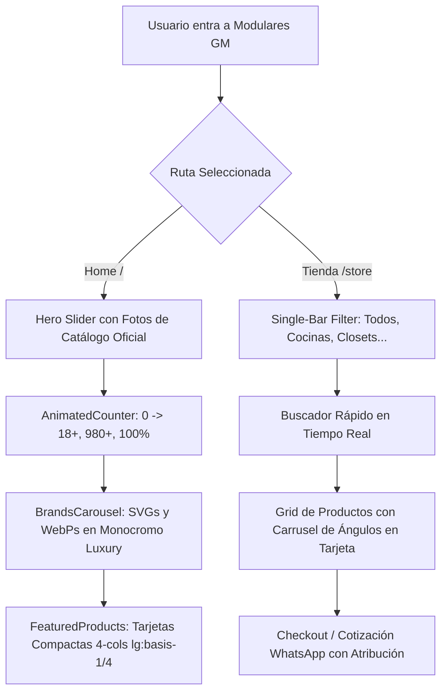

# 🏛️ Refinamiento de Tienda, Hero Curado y Branding Vectorial (09)

Este documento registra la arquitectura de la tienda, optimización del Hero slider, integración de logotipos oficiales en WebP/SVG y la armonización de paleta cromática granito/negro profundo de [[07_Architectural_Luxury_Redesign]] y [[08_Catalog_Curation_and_Store_Sync]].

---

## 📐 1. Diagrama de Flujo Arquitectónico de Tienda y Hero

---

## 🎨 2. Paleta Cromática Dual (Granito Cálido & Negro Obsidiana)

Siguiendo las especificaciones directas:
- **Modo Claro (`:root`)**: Fondo en granito caliza cálido mineral (`hsl(40 20% 97%)` / `#FAF8F5`), bordes en caliza suave (`hsl(38 15% 88%)` / `#E6E3DC`) y tipografía grafito nítido (`#14171F`).
- **Modo Oscuro (`.dark`)**: Fondo en negro obsidiana profundo (`hsl(225 24% 4.8%)` / `#0A0C10`), tarjetas en grafito elevado (`hsl(224 20% 7.8%)` / `#0F1218`) y acentos en oro cuarzo vibrante (`#E8A222`).

---

## 🏷️ 3. Ecosistema de Marcas Certificadas (Logotipos Vectoriales & WebP)

Se eliminaron los textos planos fallback en fuentes genéricas sustituyéndolos por activos de alta definición en `public/brands/`:
- `blum.svg`: Logotipo oficial vectorizado de Blum Austria.
- `hafele.svg`: Logotipo oficial vectorizado de Häfele Alemania.
- `teka.svg`: Logotipo oficial vectorizado de Teka electrodomésticos.
- `silestone.svg`: Logotipo oficial vectorizado de Silestone Cosentino.
- `dekton.svg`: Logotipo oficial vectorizado de Dekton Cosentino.
- `cosentino.svg`: Logotipo oficial vectorizado de Grupo Cosentino.
- `novopan.webp`: Logotipo de Novopan del Ecuador con canal alfa limpio.
- `pelikano.webp`: Logotipo de Pelikano tableros melamínicos con canal alfa limpio.
- `briggs.webp`: Logotipo de Briggs acabados y sanitarios de lujo.

Renderizado con filtro monocromo sutil (`grayscale opacity-60 hover:grayscale-0 dark:brightness-200 dark:contrast-125 dark:opacity-70 dark:hover:opacity-100`) para una integración editorial de revista Awwwards.

---

## 🛒 4. Eliminación del Doble Filtro en `/store`

- Se eliminó la fila superior de 7 tarjetas con enlaces ("Ver sección ->") que generaba redundancia visual.
- Se mantuvo **únicamente** la barra flotante con selector de píldoras horizontales (`Todos`, `Cocinas`, `Closets`, `Muebles de Baño`, `Puertas`, `Gamer`, `Muebles de Oficina`, `Escritorios`) y la barra de búsqueda en tiempo real, armonizando la experiencia exactamente con `[[08_Catalog_Curation_and_Store_Sync]]`.

---

## ⚡ 5. Contador Animado de Estadísticas (`AnimatedCounter`)

Se implementó el componente con `IntersectionObserver` y easing cúbico de Emil Kowalski (`1 - Math.pow(1 - progress, 3)`), garantizando un conteo suave de 0 al valor objetivo (`18+`, `980+`, `100%`) en cuanto la franja entra en el viewport del usuario.
