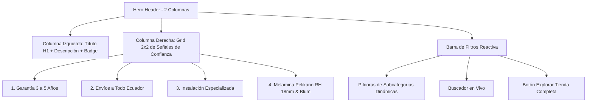

# 11. Modo Claro por Defecto, Migración Total a WebP y Rediseño Hero 2x2 en Catálogo

Este documento describe la arquitectura y ejecución técnica aplicada según los estándares de ingeniería y calidad web A+ de [[08_Catalog_Curation_and_Store_Sync]] y [[09_Storefront_Concierge_and_Redirects]].

---

## 🏛️ 1. Modo Claro Predeterminado y Control de Tema en `/admin`

- **Arranque en Modo Claro:** Configurado `defaultTheme="light"` en `src/app/layout.tsx` para toda la plataforma (sitio público, tienda, catálogo y panel de administración).
- **Selector Rápido en Admin:** Se implementó el componente interactivo de cambio de tema (Sol / Luna) en la cabecera fija de `src/components/admin/dashboard-client.tsx`, permitiendo alternar entre modo claro y oscuro con un solo clic.
- **Claridad de Pestañas:** Se renombró la pestaña `brands` a **"Marcas y Experiencia (Stats)"** para que la edición de estadísticas y marcas sea inmediatamente ubicable.

---

## ⚡ 2. Migración Total a WebP (0% Formatos Antiguos)

Para cumplir con las directrices de Core Web Vitals y evitar penalizaciones de Google:
- **Conversión Completa:** Se procesaron con `sharp` todas las imágenes del catálogo en `public/images/catalog/` (`.jpg` y `.png` fueron convertidos a `.webp` a 85% de calidad).
- **Consistencia en Rutas:** Se actualizaron todas las referencias en `src/lib/catalog-full.ts`, `src/lib/data.ts`, `src/components/home/hero-slider/hero-slider-data.ts` y en `siteContent/main` de Firebase Firestore.

---

## 📐 3. Rediseño Arquitectónico del Hero y Filtros Interactivos

Tanto en la vista general de Lookbook ([`/catalogo`](file:///c:/Users/pablo/OneDrive/Desktop/proyectos%20web/modularesgm/src/app/(public)/catalogo/page.tsx)) como en las páginas específicas de categoría ([`/cocinas`](file:///c:/Users/pablo/OneDrive/Desktop/proyectos%20web/modularesgm/src/app/(public)/cocinas/page.tsx), [`/closets`](file:///c:/Users/pablo/OneDrive/Desktop/proyectos%20web/modularesgm/src/app/(public)/closets/page.tsx), etc.):

### Componentes Involucrados:
- `src/components/catalog/catalogo-explorer.tsx`: Vista editorial con 2 columnas, grid 2x2 de sellos de garantía, píldoras por colección, buscador en tiempo real y enlace a `/store`.
- `src/components/catalog/category-showcase.tsx`: Adaptación para categorías especializadas con filtrado instantáneo por subcategorías (ej. en cocinas: *Línea de Autor, Islas con Cuarzo, Cocinas en L, Lineales Modernas, Alacenas & Torres*).

---

## 🔒 4. Respaldo de Datos y "Restaurar" en Admin

- En `src/lib/data.ts` se sustituyó la referencia a `PlaceHolderImages` por `defaultServices` con servicios auténticos de Modulares GM en formato `.webp`.
- Se actualizó el valor de `10+` a `18+` años de experiencia directamente en Firestore `siteContent/main.stats`.
- Ahora, si el usuario pulsa "Restaurar" en cualquier formulario de administración, se cargan los servicios y datos reales de la empresa.
