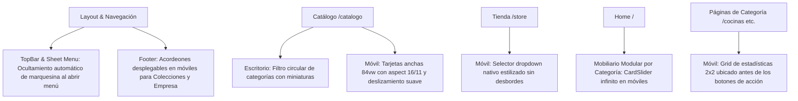

# 12. Optimización Móvil Luxury y Filtro Circular de Catálogo en Escritorio

Este documento registra la reingeniería de la experiencia en dispositivos móviles y la implementación del filtro circular de categorías para escritorio, asegurando una navegación fluida, estéticamente impecable y de alta conversión.

---

## 📐 Arquitectura de Componentes Modificados

---

## 📱 1. Mejoras Específicas en Experiencia Móvil

### A. Selector Dropdown en Tienda (`/store`)
- En dispositivos móviles (`md:hidden`), los botones horizontales tipo pills fueron reemplazados por un menú desplegable `<select>` estilizado con un ícono `ChevronDown`, garantizando cero saltos de línea ni cortes de pantalla.

### B. Ocultamiento de la Marquesina en Menú Móvil
- Al abrir el menú tipo hamburguesa, se inyecta la clase `mobile-nav-open` en `document.documentElement`.
- La marquesina superior (`top-bar.tsx`) se oculta automáticamente (`[[html.mobile-nav-open_&]]:hidden`) y el drawer del menú (`sheet.tsx`) se eleva a `z-[100]`, eliminando solapamientos visuales.

### C. Carrusel Infinito de Categorías en Home (`storefront-sections.tsx`)
- En lugar de un scroll plano con barra horizontal, se integró el componente `CardSlider` basado en **Embla Carousel** (`loop: true`) para ambas filas:
  1. *Líneas Residenciales* (Cocinas, Closets, Baños).
  2. *Líneas Especializadas & Corporativas* (Oficinas, Estimulación Temprana, Racks TV, Gamer).
- En escritorio (`hidden md:grid`) se mantiene la grilla arquitectónica de 3 y 4 columnas.

### D. Acordeón Desplegable en el Footer (`footer.tsx`)
- En móviles, las extensas listas de *"Colecciones GM"* y *"Empresa"* ahora son cintas colapsables con micro-interacciones táctiles y rotación de flecha (`ChevronDown`).
- Esto reduce la altura vertical del footer en más de un 60%, evitando el scroll infinito.

### E. Proporciones de Tarjetas de Catálogo (`/catalogo`)
- Las fotos de proyectos en móvil se ajustaron a `w-[84vw]` con relación de aspecto `aspect-[16/11]`, asegurando visibilidad clara de texturas, cuarzos y acabados sin recortes prematuros.

### F. Reordenamiento de Estadísticas en Categorías (`/cocinas`, `/closets`, etc.)
- La cuadrícula de 2x2 de estadísticas y métricas de calidad ahora se renderiza **antes** del botón de acción principal en móviles.

---

## 🖥️ 2. Filtro Circular de Categorías para Escritorio (`catalogo-explorer.tsx`)

Siguiendo la referencia de diseño del usuario:
- Se implementó la sección **"Nuestras Categorías"** exclusivamente para escritorio (`hidden md:block`).
- Cada categoría presenta un avatar circular con imagen fotográfica en alta resolución, borde iluminado en selección activa y label tipográfico.
- En móviles se conserva la barra de búsqueda y filtros compactos para maximizar la velocidad de exploración táctil.

---

## 🔗 Enlaces Relacionados
- [[07_Architectural_Luxury_Redesign]]
- [[08_Catalog_Curation_and_Store_Sync]]
- [[11_Light_Mode_WebP_Hero_and_Filters]]
