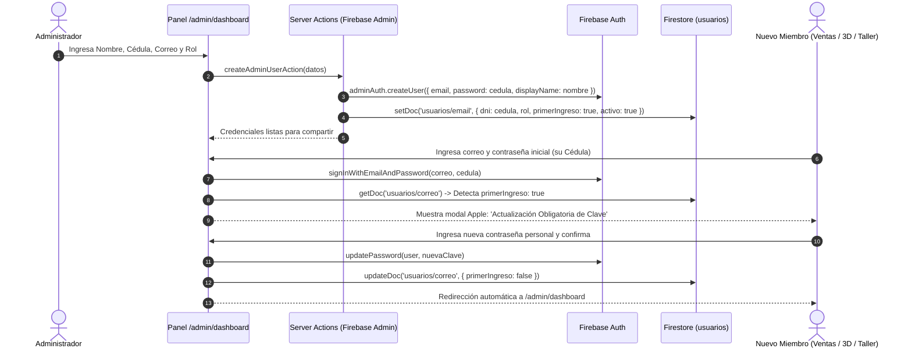

# 13. Gestión de Usuarios, Roles, Flujo de Primer Ingreso y UI Apple

Este documento registra la arquitectura de seguridad y gestión de personal implementada en el panel administrativo de Modulares GM, siguiendo el estándar de EnergyEngine y los principios de diseño de Apple macOS Sequoia.

---

## 🔐 1. Flujo de Autenticación y Primer Ingreso

---

## 🎨 2. Transformación UI/UX Estilo Apple (macOS Sequoia)

- **Barra Lateral Translúcida:**
  - `backdrop-blur-2xl` con fondo semitransparente `bg-stone-50/70 dark:bg-[#0c0e12]/70`.
  - Bordes tenues `border-stone-200/80 dark:border-stone-800/80`.
  - Píldoras de navegación activas redondeadas en `rounded-2xl` con micro-interacciones táctiles `active:scale-95`.
- **Insignias y Avatares de Roles:**
  - **Administrador:** Píldora suave `bg-rose-500/10 text-rose-700 dark:text-rose-400 border-rose-500/20`.
  - **Diseñador 3D / Renders:** Píldora `bg-purple-500/10 text-purple-700 dark:text-purple-400 border-purple-500/20`.
  - **Asesor Comercial (Ventas):** Píldora `bg-blue-500/10 text-blue-700 dark:text-blue-400 border-blue-500/20`.
  - **Técnico de Instalación:** Píldora `bg-amber-500/10 text-amber-700 dark:text-amber-400 border-amber-500/20`.
  - **Afiliado VIP:** Píldora `bg-emerald-500/10 text-emerald-700 dark:text-emerald-400 border-emerald-500/20`.
- **Gestión Completa:**
  - Creación con generación de clave inicial = Cédula.
  - Modal con botón para copiar credenciales formateadas con 1 clic.
  - Restablecimiento rápido de contraseña a la cédula en caso de olvido.
  - Alternador de estado Activo/Inactivo sin eliminar el registro histórico.
  - Eliminación segura tanto en Firestore como en Firebase Auth.

---

## 🛠️ 3. Solución al Error 400 de Vercel en Imágenes

- **Causa:** Vercel limita las optimizaciones dinámicas en su plan gratuito (1,000 transformaciones/mes). Al superar la cuota, Vercel responde con `400 Bad Request` en `/_next/image?url=...`.
- **Solución Definitiva:** Se configuró `images: { unoptimized: true }` en `next.config.ts`.
- **Beneficio:** Dado que todas las más de 280 imágenes del catálogo ya fueron convertidas a formato `.webp` optimizado, Vercel las entrega de forma estática ultrarrápida desde su CDN global sin consumir cuotas de serverless ni arrojar errores 400 en la consola.

---

## 🔗 Enlaces Relacionados
- [[07_Architectural_Luxury_Redesign]]
- [[11_Light_Mode_WebP_Hero_and_Filters]]
- [[12_Mobile_UX_and_Desktop_Catalog_Filter]]
