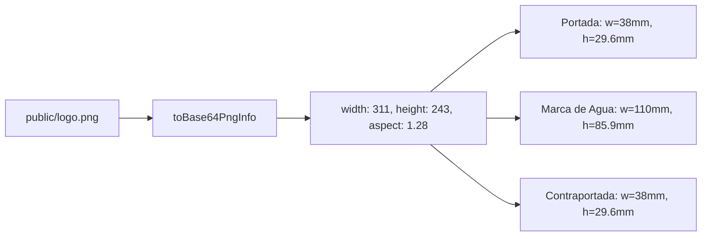
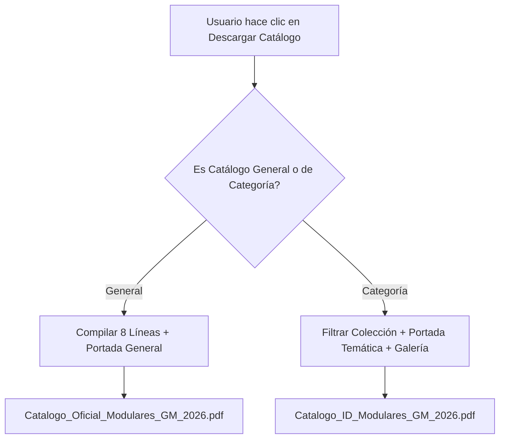

# 14. Calibración Gráfica PDF, Catálogos por Categoría y Ergonomía de Filtros

Este documento detalla la arquitectura y soluciones implementadas para la generación de PDFs editoriales de alta resolución, la calibración milimétrica del logotipo, la individualización de catálogos por categoría y la visualización ergonómica en un solo golpe de vista (*above-the-fold*).

Relacionado con:
- [[12_Mobile_UX_and_Desktop_Catalog_Filter]]
- [[13_Admin_Users_Roles_and_Apple_UI]]
- [[08_Catalog_Curation_and_Store_Sync]]

---

## 📐 1. Calibración Geométrica del Logotipo en PDF (`public/logo.png`)

### Problema Detectado
El logotipo original de **Modulares GM** cuenta con dimensiones naturales de **311px de ancho por 243px de alto** (relación de aspecto de $1.2798$). Al renderizarse en el motor jsPDF (`src/lib/catalog-pdf-generator.ts`), se forzaban dimensiones cuadradas ($28 \times 28$, $32 \times 32$ y $110 \times 110$), lo que provocaba una compresión horizontal y una elongación vertical visible.

### Solución Arquitectónica
Se implementó la función `toBase64PngInfo` que inspecciona dinámicamente las propiedades naturales de la imagen y calcula el `aspect ratio` real:



---

## 📚 2. Generación de Catálogos Especializados por Categoría

Se extendió el motor `generateLuxuryCatalogPdf(categoryId?: string, onProgress?: (msg: string) => void)`:

1. **Catálogo Completo:** Si no se especifica categoría o se pasa `'todos'`, se compilan las 8 líneas maestras en `Catalogo_Oficial_Modulares_GM_2026.pdf`.
2. **Catálogos Especializados:** Si se invoca desde una colección particular (ej. `cocinas`, `closets`, `bano`, etc.):
   - Portada con título de autor específico (`Catálogo Especializado: Cocinas Integrales con Cuarzo 2026`).
   - Doble página editorial con fotografía principal, especificaciones técnicas y galería de proyectos.
   - Contraportada institucional de contacto y garantía de fábrica.
   - Descarga con nomenclatura limpia: `Catalogo_COCINAS_Modulares_GM_2026.pdf`.



---

## 🎯 3. Ergonomía de Pantalla: "En un Solo Golpe de Vista"

### Compensación de Altura (Above-the-Fold)
Tanto en `/catalogo` (`src/components/catalog/catalogo-explorer.tsx`) como en `/store` (`src/app/(public)/store/page.tsx`):
- Reducción de márgenes y paddings excesivos en Hero (`pt-4 sm:pt-6` en lugar de `pt-24`).
- Chips de garantía compactos ($2 \times 2$) integrados al encabezado editorial.
- Círculos de categoría calibrados a `w-14 h-14` / `lg:w-16 lg:h-16`, permitiendo que las 9 opciones se aprecien simultáneamente en una sola fila sin desbordamiento.
- `emblaCarousel` configurado con `loop: false` y `containScroll: 'trimSnaps'`, garantizando que ningún círculo sufra cortes laterales en su circunferencia.

---

## 🧭 4. Corrección de Desplazamiento y Offset de Cabecera Fija

Se eliminó el método nativo `scrollIntoView` que colocaba los títulos debajo de la barra de navegación fija:

```typescript
// Offset calibrado para sticky header (64px) + sticky controls (56px) + respiro (24px)
const headerOffset = 144;
const y = el.getBoundingClientRect().top + window.pageYOffset - headerOffset;
window.scrollTo({ top: Math.max(0, y), behavior: 'smooth' });
```

En la tienda (`/store`), el scroll posiciona al usuario en `#store-controls` (`headerOffset: 80px`), mostrando de inmediato la categoría activa, el buscador y el inicio del catálogo sin descender en exceso.
