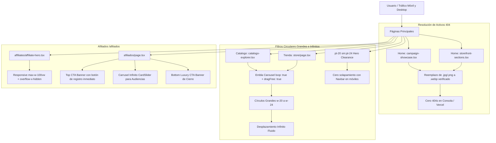

# 15. Corrección de Imágenes WebP, Filtro Circular Infinito y Rediseño de Afiliados

Este documento detalla la resolución de los problemas de imágenes rotas (404), la restitución del carrusel infinito para los filtros de catálogo/tienda con círculos de gran formato, y la modernización con llamados a la acción de alta conversión en la página de afiliados.

---

## 🧭 Diagrama de Flujo del Sistema (Mermaid)

---

## 🛠️ Detalle de Cambios Ejecutados

### 1. Eliminación de Errores 404 de Imágenes
- En `src/components/home/campaign-showcase.tsx`:
  - Reemplazadas todas las rutas con extensión `.jpg` y `.png` que no existían por las imágenes reales `.webp` de `public/images/catalog/`.
- En `src/components/home/storefront-sections.tsx`:
  - Reemplazadas todas las referencias a `.jpg` y `.png` por sus contrapartes `.webp`.
- Verificación exhaustiva: 0 referencias huérfanas en el proyecto.

### 2. Carruseles Infinitos de Categorías (Tienda y Catálogo)
- Restituido `useEmblaCarousel({ loop: true, align: 'start', dragFree: true })` en `CatalogoExplorer` y `StorePage`.
- Círculos dimensionados a tamaño de alta fidelidad `w-20 h-20 sm:w-22 sm:h-22 lg:w-24 lg:h-24` con bordes y efectos glow al seleccionar.
- Controles prev/next y soporte para arrastrar (`dragFree`) libremente.
- Ajuste de clearance móvil (`pt-20 sm:pt-24`) para evitar que el navbar tape los títulos.

### 3. Rediseño de Afiliados (`/afiliados`)
- **Top CTA Banner**: Reemplazo del párrafo estático por un banner con propuesta de valor clara, beneficios y botón `[Registrarme Gratis como Afiliado GM]`.
- **Carrusel Infinito de Audiencias**: La sección "Para quién es este programa" ahora usa `CardSlider` con `loop: true` y autoplay para mostrar dinámicamente los 6 perfiles.
- **Bottom CTA Banner**: Banner de cierre en gradiente oscuro y botón de alta conversión.
- **Hero Móvil**: Ajuste de ancho con `max-w-[100vw] overflow-x-hidden` para evitar desbordamientos horizontales.

---

## 🔗 Enlaces Relacionados (Obsidian)
- [[06_UI_UX_Premium]]
- [[08_Catalog_Curation_and_Store_Sync]]
- [[10_Affiliates_and_UX_Overhaul]]
- [[11_Light_Mode_WebP_Hero_and_Filters]]
- [[12_Mobile_UX_and_Desktop_Catalog_Filter]]
- [[14_Catalog_PDF_Aspect_Ratio_and_Viewport_Fit]]
