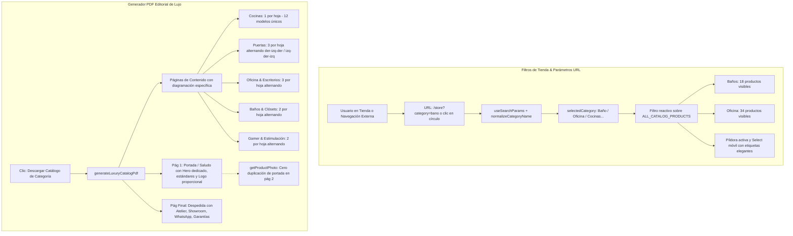

# 16. Corrección de Filtros de Tienda (Baño/Oficina) y Motor de Catálogos PDF Multi-Página de Autor

Este documento detalla la solución definitiva para la reconexión de los filtros de **Baños** y **Oficina** en la tienda oficial, la sincronización de parámetros URL (`?category=bano`, `?category=oficina`), y la reconstrucción completa del generador de catálogos en PDF (`src/lib/catalog-pdf-generator.ts`) para incluir todos los modelos de cada categoría con diagramación editorial estricta, saludo, despedida y cero duplicación de fotografías.

---

## 🧭 Diagrama de Arquitectura & Flujo (Mermaid)

---

## 🛠️ Detalle de Implementación Técnica

### 1. Reconexión de Filtros de Baño y Oficina (`src/app/(public)/store/page.tsx`)
- **Causa Raíz Identificada:**
  - Los productos en `ALL_CATALOG_PRODUCTS` están clasificados como `"Baño"` y `"Oficina"`.
  - Los botones circulares en la tienda tenían IDs como `"Muebles de Baño"` y `"Muebles de Oficina"`.
  - La comparación estricta `product.category === selectedCategory` fallaba, arrojando 0 resultados.
  - Además, la página de la tienda no leía los parámetros de búsqueda de la URL (`?category=bano`).
- **Solución Implementada:**
  - Función de normalización canónica `normalizeCategoryName()` que traduce `'bano'`, `'muebles-bano'`, `'vanity'` a `'Baño'`, y `'oficina'`, `'muebles-oficina'`, `'corporativo'` a `'Oficina'`.
  - Sincronización automática de `useSearchParams()` dentro de un límite `<Suspense>` para hidratación limpia en Next.js.
  - Los 18 productos de Baño y los 34 productos de Oficina ahora se visualizan instantáneamente tanto al hacer clic en los círculos como al ingresar con URL directa.
  - Etiquetas amigables en el select móvil y en la píldora superior (`CATEGORY_LABELS`).

### 2. Motor de Catálogos PDF Multi-Página (`src/lib/catalog-pdf-generator.ts`)
- **Reglas Editoriales Implementadas:**
  1. **Portada / Saludo (Página 1):**
     - Logotipo proporcional en cabecera (sin estiramiento vertical).
     - Hero dedicado para cada categoría.
     - Caja de estándares certificados de fabricación (Pelikano RH 18mm, herrajes Blum, cuarzo Calacatta).
     - Marca de agua translúcida centrada con proporción exacta.
  2. **Cero Duplicación de Portada:**
     - La función `getProductPhoto()` evalúa si la foto principal del primer modelo coincide con la portada, en cuyo caso selecciona automáticamente su ángulo alternativo (`images[1]`), garantizando que la página 2 muestre una fotografía completamente fresca.
  3. **Cocinas (1 por hoja):**
     - Cada página muestra 1 diseño único de cocina con fotografía de gran formato (174mm x 118mm), párrafo descriptivo justificado, cuadro de especificaciones técnicas y fotografía de ángulo secundario/detalle cuando está disponible. Total: 12 páginas de cocinas exclusivas.
  4. **Puertas (3 por hoja alternando):**
     - Diagramación alternada:
       - Páginas pares: Fila 0 (Foto Izq, Texto Der), Fila 1 (Texto Izq, Foto Der), Fila 2 (Foto Izq, Texto Der).
       - Páginas impares: Fila 0 (Texto Izq, Foto Der), Fila 1 (Foto Izq, Texto Der), Fila 2 (Texto Izq, Foto Der).
       - Total: 20 puertas distribuidas en 7 páginas de alta densidad visual.
  5. **Muebles de Oficina & Escritorios (3 por hoja alternando):**
     - Mismo patrón alternante de 3 slots verticales con especificaciones de melamina, conectividad y precios referenciales.
  6. **Muebles de Baño & Clósets (2 por hoja alternando):**
     - 2 módulos generosos por página con fotografías de 86mm x 114mm, fichas técnicas con viñetas y cotizaciones referenciales.
  7. **Despedida / Contraportada (Página Final):**
     - Fondo pizarra oscura de lujo (`#1A1612`), marco perimetral dorado, dirección del Atelier en Quito (`Rosa Yeira 420 y Serpaio Japeravi`), WhatsApp, sitio web, correo y cobertura técnica nacional.

---

## 🔗 Enlaces Relacionados (Obsidian)
- [[08_Catalog_Curation_and_Store_Sync]]
- [[09_Store_Refinement_and_Hero_Branding]]
- [[12_Mobile_UX_and_Desktop_Catalog_Filter]]
- [[14_Catalog_PDF_Aspect_Ratio_and_Viewport_Fit]]
- [[15_Image_404_Fix_Infinite_Carousels_and_Affiliates_CTA]]
